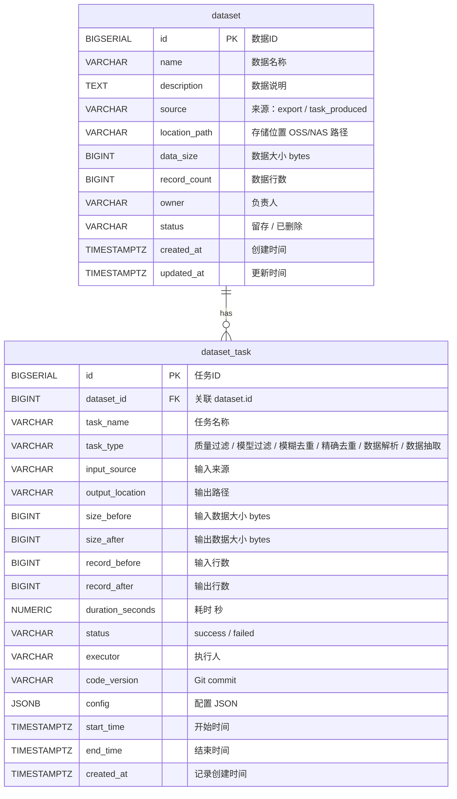

# 工程资产管理平台 — 数据库 ER 图



## 表关系说明

| 关系 | 说明 |
|------|------|
| `dataset 1 ── N dataset_task` | 一个数据资产可以关联多条任务记录（如：生成 → 清洗 → 转换） |
| `dataset_task.dataset_id` → `dataset.id` | 外键约束，删除 dataset 时级联删除关联的 task 记录 |

## 核心查询路径

```
dataset  ←─ JOIN ─→  dataset_task
  ↑                      ↑
  │                      │
  │  通过 dataset_id 关联  │
  │                      │
  └──────────────────────┘
  "某个数据是怎么来的？"
  "这个任务产出了哪些数据？"
